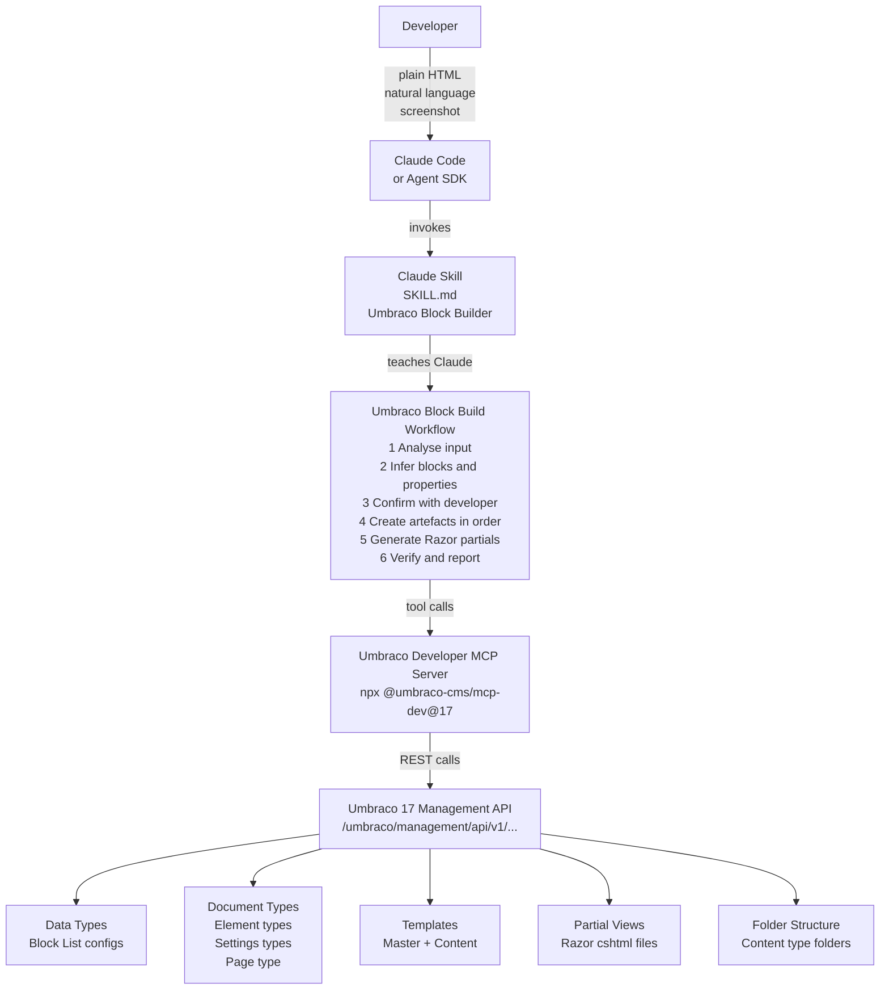
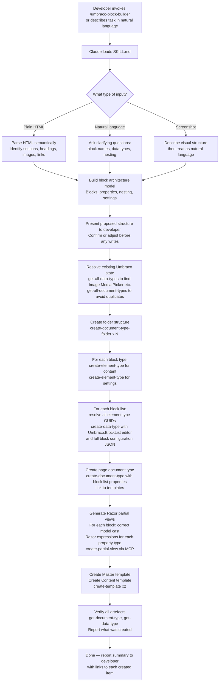
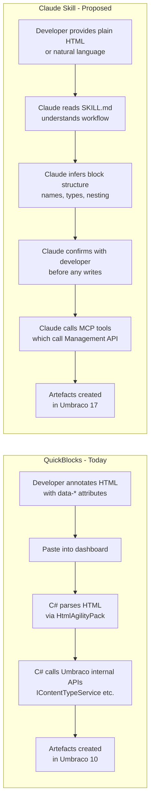

# QuickBlocks as a Claude Skill
### How the Umbraco Developer MCP Server and Claude Agent Skills Replace a Custom Package

---

## Table of Contents

1. [The Problem, Restated](#1-the-problem-restated)
2. [Why QuickBlocks Has a Ceiling](#2-why-quickblocks-has-a-ceiling)
3. [The New Stack](#3-the-new-stack)
4. [Architecture](#4-architecture)
5. [The Umbraco Developer MCP Server](#5-the-umbraco-developer-mcp-server)
6. [Exact MCP Tools Used](#6-exact-mcp-tools-used)
7. [How the Skill Works — Step by Step](#7-how-the-skill-works--step-by-step)
8. [The Skill Definition](#8-the-skill-definition)
9. [MCP Configuration](#9-mcp-configuration)
10. [Processing Pipeline Comparison](#10-processing-pipeline-comparison)
11. [What the Developer Does Differently](#11-what-the-developer-does-differently)
12. [Worked Example](#12-worked-example)
13. [Known Considerations](#13-known-considerations)
14. [Future Possibilities](#14-future-possibilities)

---

## 1. The Problem, Restated

Building a block-list-based Umbraco site from an HTML prototype requires creating a large number of tightly coupled artefacts manually:

- Element content types (one per block)
- Settings content types (one per block)
- Block list data types (one per list, referencing the above by GUID)
- Razor partial views (one per block, with correct model casts)
- A page content type with the correct block list properties
- Master and content templates
- A folder structure to keep it organised

Doing this by hand for a site with 10–15 block types takes hours and is highly error-prone. QuickBlocks automates it from an annotated HTML file.

---

## 2. Why QuickBlocks Has a Ceiling

QuickBlocks is effective but constrained by its design:

| Constraint | Impact |
|---|---|
| Requires `data-*` annotation | The developer still does the hard thinking; HTML must be rewritten to use QuickBlocks vocabulary |
| Input is always HTML | Can't accept a description, a screenshot, or a Figma link |
| Runs inside Umbraco (C# package) | Tied to Umbraco 10's internal APIs; porting to Umbraco 14–17 requires rewriting against the new Management API |
| No conversation or iteration | One-shot; if the output is wrong you adjust attributes and re-run |
| Black box | Doesn't explain why it made each decision |
| No version targeting | Outputs Umbraco 10 conventions; block list JSON schema changed in Umbraco 17 |
| Maintenance burden | Every Umbraco major version break requires C# package updates and a new NuGet release |

The annotation step is the sharpest problem. Writing:

```html
<section data-row-name="Hero"
         data-settings-name="Hero Settings"
         data-has-settings="true"
         data-icon-class="icon-landscape"
         data-label-property="Title">
  <h1 data-prop-name="Title">Heading</h1>
  <p  data-prop-name="Body Text">Description</p>
```

…is not dramatically faster than creating the content type by hand. It requires the same Umbraco domain knowledge. It's a domain-specific language that happens to look like HTML.

---

## 3. The New Stack

Three components, each doing what it is best at:

| Component | Role |
|---|---|
| **Claude** (via Claude Code or Agent SDK) | Understands intent, infers structure, generates Razor, makes decisions |
| **Umbraco Developer MCP Server** | Executes operations against a live Umbraco 17 instance via 330+ tools wrapping the Management API |
| **Claude Skill (`SKILL.md`)** | Teaches Claude the Umbraco block list workflow — the sequence of steps, naming conventions, and pitfalls |

None of these require a C# Umbraco package. The skill is a Markdown file. The MCP server is an npm package run via `npx`. The Management API is built into Umbraco 14+.

---

## 4. Architecture



---

## 5. The Umbraco Developer MCP Server

The **Umbraco Developer MCP Server** is an official Umbraco product (originally community-built by Matthew Wise, adopted into the Umbraco GitHub organisation).

- **NPM package**: `@umbraco-cms/mcp-dev@17`
- **Repo**: [github.com/umbraco/Umbraco-CMS-MCP-Dev](https://github.com/umbraco/Umbraco-CMS-MCP-Dev)
- **Docs**: [docs.umbraco.com/umbraco-cms/reference/developer-mcp](https://docs.umbraco.com/umbraco-cms/reference/developer-mcp)
- **Scale**: 330+ tools across 36 endpoint groups, near-complete parity with the Management API
- **Auth**: Umbraco API User (OAuth2 client credentials) — fine-grained permission control
- **Transport**: runs as a local `stdio` process via `npx`; no installation required

The server exposes named **tool collections**. You opt in to only the ones you need:

```
document-type  data-type  template  partial-view  document
script  stylesheet  media  language  log-viewer  webhook  …
```

For a QuickBlocks-equivalent workflow, only five collections are needed:
`document-type`, `data-type`, `template`, `partial-view`, `document`

---

## 6. Exact MCP Tools Used

The following MCP tools map directly to the steps QuickBlocks performs in C#:

### Folder structure

| QuickBlocks (C#) | MCP Tool |
|---|---|
| `IContentTypeService.Save()` (folder) | `create-document-type-folder` |

### Element and settings content types

| QuickBlocks (C#) | MCP Tool |
|---|---|
| `IContentTypeService.Save()` (element) | `create-element-type` |
| `IContentTypeService.Save()` (page) | `create-document-type` |
| `AddPropertiesToContentType()` | `update-document-type` (with properties array) |
| Check if type exists | `get-document-type` / `get-all-document-types` |
| `get-document-type-available-compositions` | `get-document-type-available-compositions` |

### Data types / block lists

| QuickBlocks (C#) | MCP Tool |
|---|---|
| `IDataTypeService.Save()` | `create-data-type` |
| Check if data type exists | `get-data-type-search` |
| Get property editor schema | `get-data-type-property-editor-template` |
| Resolve existing data type GUID | `get-all-data-types` |

### Templates

| QuickBlocks (C#) | MCP Tool |
|---|---|
| `IFileService.SaveTemplate()` | `create-template` |
| Template query helpers | `get-template-query-settings` |

### Partial views

| QuickBlocks (C#) | MCP Tool |
|---|---|
| `IFileService.SavePartialView()` | `create-partial-view` (via `partial-view` collection) |

### Verification

| Purpose | MCP Tool |
|---|---|
| Confirm block list was created | `get-data-type` |
| Confirm element type exists | `get-document-type` |
| Check Umbraco version compatibility | `get-server-information` (called automatically on startup) |

---

## 7. How the Skill Works — Step by Step



### What Claude infers automatically (no annotation needed)

| HTML element | Inferred Umbraco data type |
|---|---|
| `` | Image Media Picker |
| `<h1>`–`<h6>` | Textstring |
| `<p>` | Rich Text Editor |
| `<a>` (single) | Single URL Picker |
| `<a>` (repeated in a list) | Multi URL Picker |
| `<video>` | Media Picker |
| Repeated sibling groups | Nested block list |
| `<section>`, `<article>`, `<div>` with distinct content | Block type boundary |

Claude uses class names, IDs, content, and document structure to infer meaningful names. `<section class="hero">` becomes a block called `"Hero"`. A `<div class="service-items">` containing repeated `<div class="service-card">` elements becomes a nested block list called `"Service Items"` with an item type `"Service Card"`.

---

## 8. The Skill Definition

A skill is a `SKILL.md` file in `.claude/skills/umbraco-block-builder/`. It has two parts: YAML frontmatter that controls invocation, and a Markdown body that is the actual instruction set Claude follows.

```markdown
---
name: umbraco-block-builder
description: >
  Scaffolds a complete Umbraco 17 block list architecture from an HTML prototype or
  natural language description. Creates element types, settings types, block list data
  types, partial views, page content types, and templates via the Umbraco Developer MCP
  Server. Use when the developer wants to set up Umbraco block lists, create content
  types from HTML, or scaffold a block-based page structure.
user_invocable: true
---

# Umbraco Block Builder

You are scaffolding a complete Umbraco 17 block list architecture.
You have access to the Umbraco Developer MCP Server via the `umbraco-mcp` MCP connection.

## Ground Rules

- NEVER create anything without first presenting the proposed structure to the developer and
  getting confirmation. A mistake here creates real artefacts in a live CMS.
- ALWAYS check for existing artefacts before creating. Use `get-all-data-types` and
  `get-all-document-types` to avoid duplicates.
- Element types MUST be created before the block list data type that references them.
  The block list needs the element type GUIDs.
- The block list data type JSON for Umbraco 17 uses an array of `{ alias, value }` pairs
  in the `configuration` field — NOT a flat object. See the schema below.
- Partial views for block list components go at:
  `Views/Partials/blocklist/Components/{alias}.cshtml`

## Step 1 — Understand the Input

Accept any of:
- Plain HTML (no data-* annotation needed)
- Natural language description ("I need a hero, a 3-column grid, and a testimonials carousel")
- A mix of both

From the input, identify:
1. The page name (becomes the page document type)
2. Each distinct block type (becomes an element type)
3. Properties on each block (infer data types from HTML elements — see table below)
4. Whether any block contains a repeating sub-group (becomes a nested block list)
5. Whether any block needs a settings type (default: yes, with a Hide toggle)

## Step 2 — Infer Data Types

| HTML element or context | Umbraco data type | Notes |
|---|---|---|
| `` | Image Media Picker | Use `get-all-data-types` to confirm the exact name |
| `<h1>`–`<h6>` | Textstring | |
| `<p>` | Rich Text Editor | |
| `<a>` (single) | Single URL Picker | |
| `<a>` (repeated / list) | Multi URL Picker | |
| `<video>` | Media Picker | |
| `<input type="text">` | Textstring | |
| `<textarea>` | Textarea | |
| `<select>` | Dropdown | |
| `<input type="checkbox">` | True/False | |
| Anything else | Textstring (default) | Ask if unsure |

Use `get-all-data-types` to resolve the exact GUID of each data type before building the
block list configuration. Never guess a GUID.

## Step 3 — Present the Proposed Structure

Before making any MCP calls that write data, output a structured summary:

```
## Proposed Block Architecture

**Page type:** Home Page (alias: homePage)

**Block list:** Main Content
  - Hero (element: heroRow)
      title: Textstring
      bodyText: Rich Text Editor
      backgroundImage: Image Media Picker
      callToAction: Single URL Picker
    settings: heroSettings (hide: True/False)

  - Services (element: servicesRow)
      title: Textstring
      [nested list] Service Items
          Service Card (element: serviceCardItem)
              title: Textstring
              description: Rich Text Editor
              icon: Image Media Picker
        settings: none

Does this look right? Reply YES to proceed, or tell me what to change.
```

Wait for confirmation before proceeding.

## Step 4 — Resolve Existing State

```
get-all-document-types   → build a map of name → id (avoid duplicates)
get-all-data-types       → build a map of name → id (resolve GUIDs for known types)
```

## Step 5 — Create in Dependency Order

Execute in this exact order (each step depends on the previous):

1. `create-document-type-folder` for each folder (Components, Elements/Content Blocks,
   Elements/Settings Models, Pages)
2. `create-element-type` for each block's content element type
3. `create-element-type` for each block's settings element type (with a Hide property)
4. `create-data-type` for each block list (using GUIDs from step 2–3)
5. `create-document-type` for the page type
6. `create-template` for the Master template
7. `create-template` for the page content template
8. Generate and `create-partial-view` for each block

## Step 6 — Block List Data Type JSON (Umbraco 17)

Use this exact `configuration` structure for `create-data-type`:

```json
{
  "name": "Main Content",
  "editorAlias": "Umbraco.BlockList",
  "editorUiAlias": "Umb.PropertyEditorUi.BlockList",
  "configuration": [
    {
      "alias": "blocks",
      "value": [
        {
          "contentElementTypeKey": "<GUID of content element type>",
          "settingsElementTypeKey": "<GUID of settings element type or null>",
          "label": "{{ !title || title == '' ? 'Hero' : title }}",
          "editorSize": "medium",
          "forceHideContentEditorInOverlay": false,
          "iconColor": "#1b264f",
          "backgroundColor": "#ffffff"
        }
      ]
    },
    { "alias": "validationLimit", "value": { "min": null, "max": null } },
    { "alias": "useSingleBlockMode", "value": false },
    { "alias": "useLiveEditing", "value": false },
    { "alias": "useInlineEditingAsDefault", "value": false },
    { "alias": "maxPropertyWidth", "value": "100%" }
  ]
}
```

IMPORTANT: Both `editorAlias` and `editorUiAlias` are required in Umbraco 17.

## Step 7 — Generate Razor Partial Views

For each block, generate a `.cshtml` file and push it via `create-partial-view`.

Template pattern:

```razor
@using ContentModels = Umbraco.Cms.Web.Common.PublishedModels;
@inherits Umbraco.Cms.Web.Common.Views.UmbracoViewPage<Umbraco.Cms.Core.Models.Blocks.BlockListItem>
@{
    var content = Model.Content as ContentModels.{PascalAlias};
    if (content == null) { return; }
}

{HTML with properties replaced by Razor expressions}
```

Property rendering rules:
- `Textstring` → `@content.{PropertyAlias}`
- `Rich Text Editor` → `@Html.Raw(content.{PropertyAlias})`
- `Image Media Picker` → ``
- `Single URL Picker` → `<a href="@content.{PropertyAlias}?.Url" target="@content.{PropertyAlias}?.Target">@content.{PropertyAlias}?.Name</a>`
- `True/False` → `@if (content.{PropertyAlias}) { ... }`
- Nested block list → `@await Html.GetBlockListHtmlAsync(content.{PropertyAlias})`

## Step 8 — Verify and Report

After all creation steps, call:
- `get-document-type` for each created document type
- `get-data-type` for each created block list

Report a summary table:

| Artefact | Name | Status |
|---|---|---|
| Element type | heroRow | ✓ Created |
| Element type | heroSettings | ✓ Created |
| Block list data type | Main Content | ✓ Created |
| Page document type | homePage | ✓ Created |
| Partial view | heroRow.cshtml | ✓ Created |
| Template | Master | ✓ Created |
| Template | Home Page | ✓ Created |

## Error Handling

- If `create-element-type` returns a conflict (already exists), use the existing type's GUID
- If `create-partial-view` returns 404 for a subfolder path (known Umbraco bug #16823),
  create the partial in the root partials folder and note the workaround
- If a GUID lookup fails, call `get-data-type-search` with the type name as a fallback
```

---

## 9. MCP Configuration

`.mcp.json` in the project root:

```json
{
  "mcpServers": {
    "umbraco-mcp": {
      "command": "npx",
      "args": ["@umbraco-cms/mcp-dev@17"],
      "env": {
        "UMBRACO_CLIENT_ID": "${UMBRACO_CLIENT_ID}",
        "UMBRACO_CLIENT_SECRET": "${UMBRACO_CLIENT_SECRET}",
        "UMBRACO_BASE_URL": "${UMBRACO_BASE_URL}",
        "UMBRACO_INCLUDE_TOOL_COLLECTIONS": "document-type,data-type,template,partial-view,document"
      }
    }
  }
}
```

**Key environment variables** (set in shell or `.env`):

| Variable | Value |
|---|---|
| `UMBRACO_CLIENT_ID` | API User client ID from Umbraco back-office |
| `UMBRACO_CLIENT_SECRET` | API User secret |
| `UMBRACO_BASE_URL` | e.g. `https://localhost:44367` |

**Limiting to five tool collections** keeps the MCP tool footprint small (avoiding context bloat) and restricts permissions to only what the workflow needs.

---

## 10. Processing Pipeline Comparison



| Dimension | QuickBlocks | Claude Skill |
|---|---|---|
| **Input** | Annotated HTML only | Plain HTML, natural language, screenshot |
| **Umbraco version** | 10 (internal APIs) | 17 (Management API via MCP) |
| **Naming** | Developer must name everything via `data-*` | Inferred from HTML semantics; confirmed before creation |
| **Data type resolution** | Developer must know Umbraco type names | Inferred from element type; resolved by GUID lookup |
| **Iteration** | Re-annotate and re-run | Conversational — "rename that", "add a field", "skip settings" |
| **Explanation** | Silent | Explains every decision; shows proposed structure before writing |
| **Maintenance** | C# NuGet package per Umbraco major version | `SKILL.md` update (Markdown) |
| **Error recovery** | Partial creation, hard to debug | Can explain what failed, retry, or suggest alternatives |
| **Custom data types** | Requires C# `IDataTypeMapper` implementation | Tell Claude in natural language |
| **Dependencies** | Umbraco.Cms.Core, HtmlAgilityPack, NuGet | `npx` (no install), one JSON config file |

---

## 11. What the Developer Does Differently

### Before (QuickBlocks)

1. Write HTML prototype
2. Re-annotate every meaningful element with `data-row-name`, `data-prop-name`, `data-prop-type`, `data-list-name`, etc.
3. Open the Umbraco back-office, navigate to the QuickBlocks dashboard
4. Paste annotated HTML
5. Click Submit
6. Debug any failures by re-annotating and re-running

### After (Claude Skill)

1. Write HTML prototype (or describe what you need)
2. Type `/umbraco-block-builder` in Claude Code (or just describe the task)
3. Review and confirm the proposed block architecture
4. Done

The annotation step — which required deep Umbraco knowledge — is gone. The developer reviews Claude's proposal rather than writing the proposal themselves.

---

## 12. Worked Example

**Input (no annotation):**

```html
<main>
  <section class="hero">
    <h1>Welcome to Acme</h1>
    <p>We build things that matter.</p>
    
    <a href="/about">Learn More</a>
  </section>

  <section class="services">
    <h2>Our Services</h2>
    <div class="service-grid">
      <div class="service-card">
        
        <h4>Service Name</h4>
        <p>Service description here.</p>
      </div>
      <div class="service-card">...</div>
      <div class="service-card">...</div>
    </div>
  </section>
</main>
```

**Claude's proposed structure (before any writes):**

```
Page type: Home Page (alias: homePage)

Block list: Main Content
├── Hero (element: heroRow)
│     title: Textstring
│     bodyText: Rich Text Editor
│     image: Image Media Picker
│     link: Single URL Picker
│   settings: heroSettings
│     hide: True/False
│
└── Services (element: servicesRow)
      title: Textstring
      [nested block list] Service Grid
          Service Card (element: serviceCardItem)
              icon: Image Media Picker
              title: Textstring
              description: Rich Text Editor
        settings: none

Does this look right? Reply YES to proceed, or tell me what to change.
```

**After confirmation, MCP calls in order:**

```
1. create-document-type-folder  → "Elements"
2. create-document-type-folder  → "Elements/Content Models"
3. create-document-type-folder  → "Elements/Settings Models"
4. create-document-type-folder  → "Pages"
5. get-all-data-types           → resolve GUIDs for Image Media Picker, Textstring, etc.
6. create-element-type          → heroRow
7. create-element-type          → heroSettings
8. create-element-type          → servicesRow
9. create-element-type          → serviceCardItem
10. create-data-type            → "Service Grid" (block list, references serviceCardItem)
11. create-data-type            → "Main Content" (block list, references heroRow + servicesRow)
12. create-document-type        → homePage (with mainContent property)
13. create-template             → Master
14. create-template             → Home Page
15. create-partial-view         → heroRow.cshtml
16. create-partial-view         → servicesRow.cshtml
17. create-partial-view         → serviceCardItem.cshtml
18. get-document-type           → verify heroRow ✓
19. get-document-type           → verify servicesRow ✓
20. get-data-type               → verify Main Content ✓
```

**Generated `heroRow.cshtml`:**

```razor
@using ContentModels = Umbraco.Cms.Web.Common.PublishedModels;
@inherits Umbraco.Cms.Web.Common.Views.UmbracoViewPage<Umbraco.Cms.Core.Models.Blocks.BlockListItem>
@{
    var content = Model.Content as ContentModels.HeroRow;
    if (content == null) { return; }
}

<section class="hero">
    <h1>@content.Title</h1>
    @Html.Raw(content.BodyText)
    
    @if (content.Link != null)
    {
        <a href="@content.Link.Url" target="@content.Link.Target">@content.Link.Name</a>
    }
</section>
```

---

## 13. Known Considerations

### Partial view subfolder bug

Umbraco has a known issue ([#16823](https://github.com/umbraco/Umbraco-CMS/issues/16823)) where `partial-view` API calls to paths at depth > 1 (e.g. `blocklist/Components/hero.cshtml`) return 404. The skill's instructions note this and fall back to placing files at root level if needed. This is a bug in Umbraco, not in the skill.

### GUID dependency ordering

The block list data type JSON requires the GUIDs of element types that must already exist. The skill enforces strict creation order to handle this. Claude will never attempt to create the block list data type before all referenced element types are confirmed created.

### Umbraco version

The MCP server is versioned to match Umbraco CMS (`@umbraco-cms/mcp-dev@17` for Umbraco 17). The block list configuration JSON structure changed between Umbraco 10 and 17 — the skill uses the v17 format (array of `{ alias, value }` pairs). Updating to Umbraco 18 requires only updating the SKILL.md schema section and the npm version pin.

### API user permissions

The MCP server authenticates as an Umbraco API User. Creating document types and data types requires admin-level permissions. A non-admin API user can still use the skill to manage content only. The skill should be connected to a **non-production environment** during scaffolding.

### Context budget

The five MCP tool collections (`document-type`, `data-type`, `template`, `partial-view`, `document`) expose roughly 100–150 tools. This is within normal context budget. If MCP Tool Search activates (Sonnet 4+ / Opus 4+), tools are loaded on demand transparently — no action needed.

---

## 14. Future Possibilities

### Figma / screenshot input

Claude's vision capability means the skill could accept a Figma screenshot or a design mockup as input. Claude identifies sections, repeating patterns, and content zones visually, then follows the same block builder workflow.

### Reverse scaffolding

Given an existing Umbraco site, use `get-all-document-types` and `get-all-data-types` to understand the current structure, then generate the HTML prototype that would have produced it — useful for documenting legacy sites.

### Umbraco.AI Agents alignment

Umbraco's official roadmap (Q2 2026) includes **Umbraco.AI Agents** for content modelling and multi-step scaffolding workflows. The pattern described in this document — skill + MCP — directly anticipates that direction. A skill built today could be migrated into the official agent framework with minimal changes.

### Live preview

After creating the block list and partial views, trigger a Umbraco Models Builder rebuild (via MCP or CLI) and render a preview of a test page using the new block types — giving the developer instant visual confirmation.

### Content population

After scaffolding the structure, use `create-document` and `update-document-properties` to populate initial content — turning a block scaffold into a full working prototype page.

---

## References

| Resource | URL |
|---|---|
| Umbraco Developer MCP Server | [docs.umbraco.com/umbraco-cms/reference/developer-mcp](https://docs.umbraco.com/umbraco-cms/reference/developer-mcp) |
| MCP Available Tools | [docs.umbraco.com/umbraco-cms/reference/developer-mcp/available-tools](https://docs.umbraco.com/umbraco-cms/reference/developer-mcp/available-tools) |
| MCP GitHub | [github.com/umbraco/Umbraco-CMS-MCP-Dev](https://github.com/umbraco/Umbraco-CMS-MCP-Dev) |
| Management API | [docs.umbraco.com/umbraco-cms/reference/management-api](https://docs.umbraco.com/umbraco-cms/reference/management-api) |
| Claude Skills docs | [code.claude.com/docs/en/skills](https://code.claude.com/docs/en/skills) |
| Claude Agent SDK | [platform.claude.com/docs/en/agent-sdk/overview](https://platform.claude.com/docs/en/agent-sdk/overview) |
| MCP + Agent SDK | [platform.claude.com/docs/en/agent-sdk/mcp](https://platform.claude.com/docs/en/agent-sdk/mcp) |
| Block list v17 forum thread | [forum.umbraco.com/t/programmatically-creating-blocklist-data-type-v17/6950](https://forum.umbraco.com/t/programmatically-creating-blocklist-data-type-v17/6950) |
| Partial view depth bug | [github.com/umbraco/Umbraco-CMS/issues/16823](https://github.com/umbraco/Umbraco-CMS/issues/16823) |
| Umbraco.AI Agents roadmap | [umbraco.com/products/knowledge-center/roadmap/](https://umbraco.com/products/knowledge-center/roadmap/) |

---

*Proposal based on Umbraco Developer MCP Server v17, Claude Agent SDK, and the Claude Code Skills system.*
