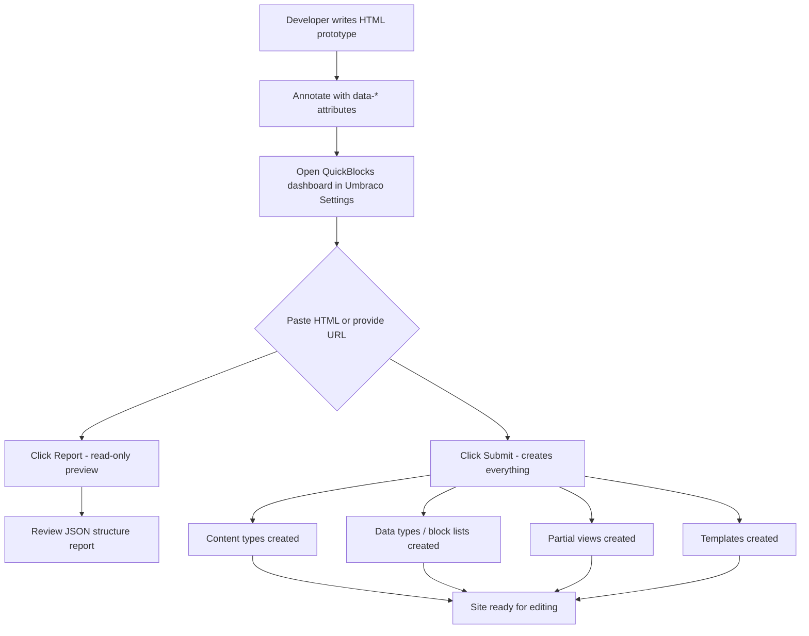
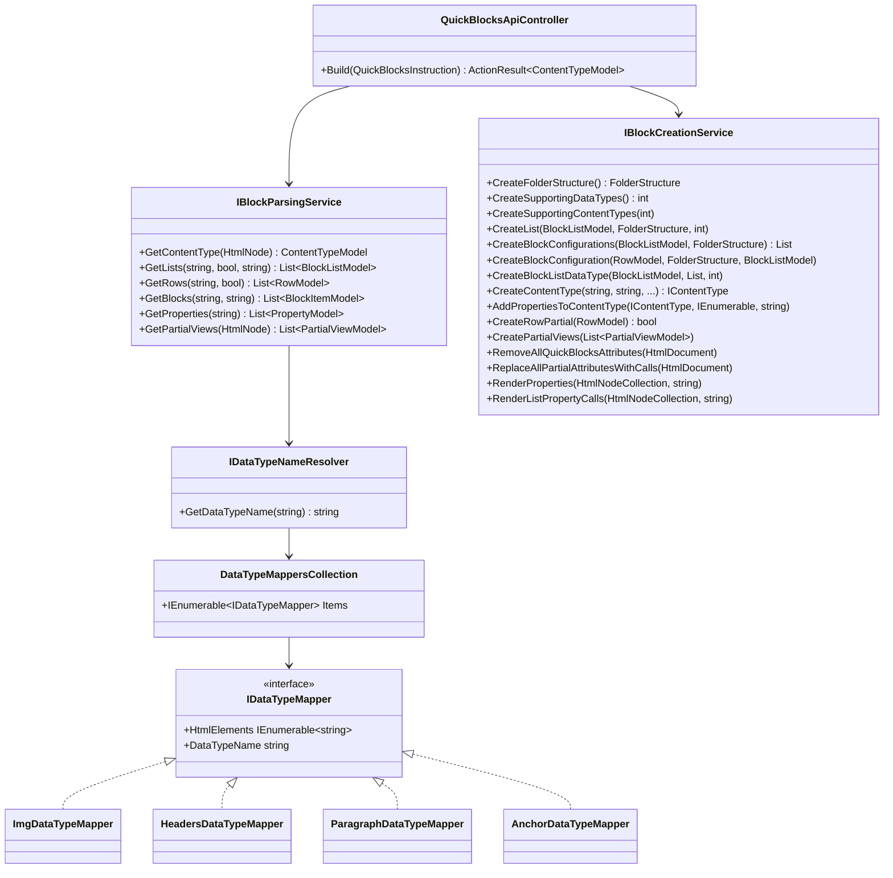
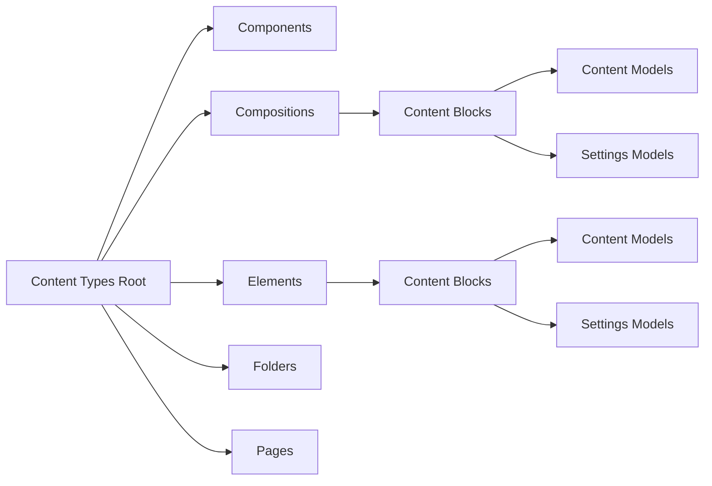
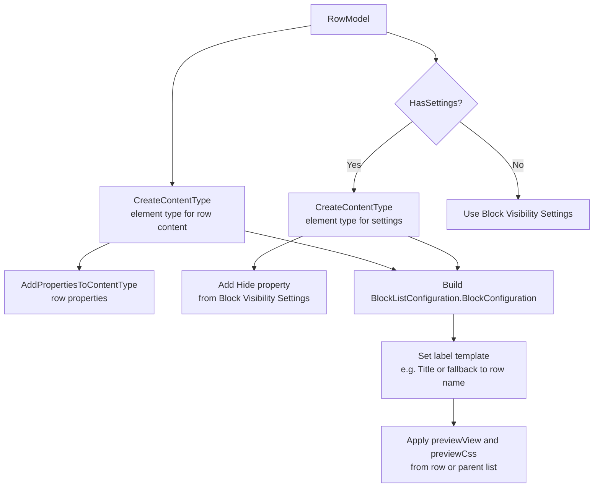
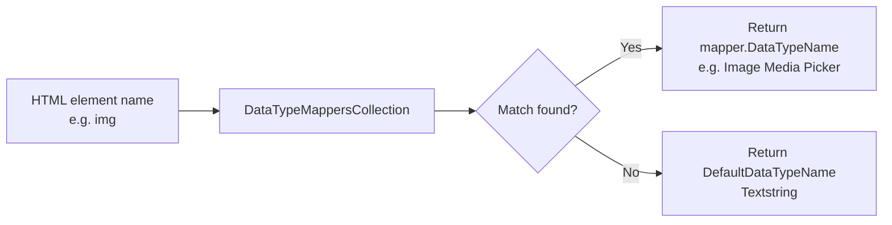
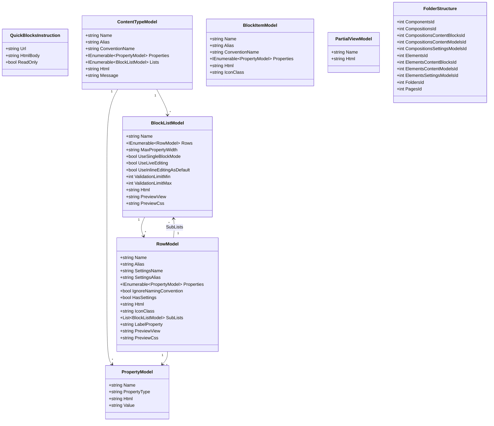
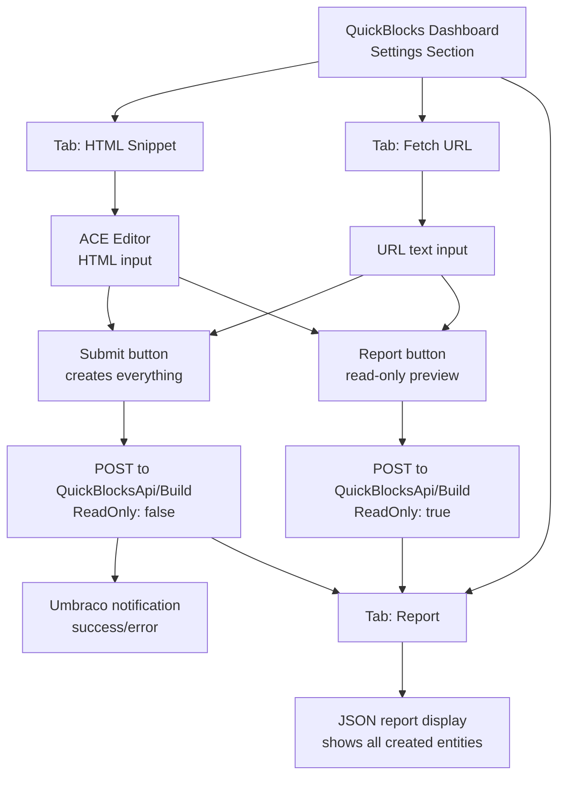
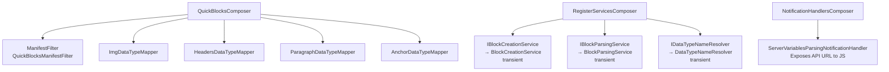
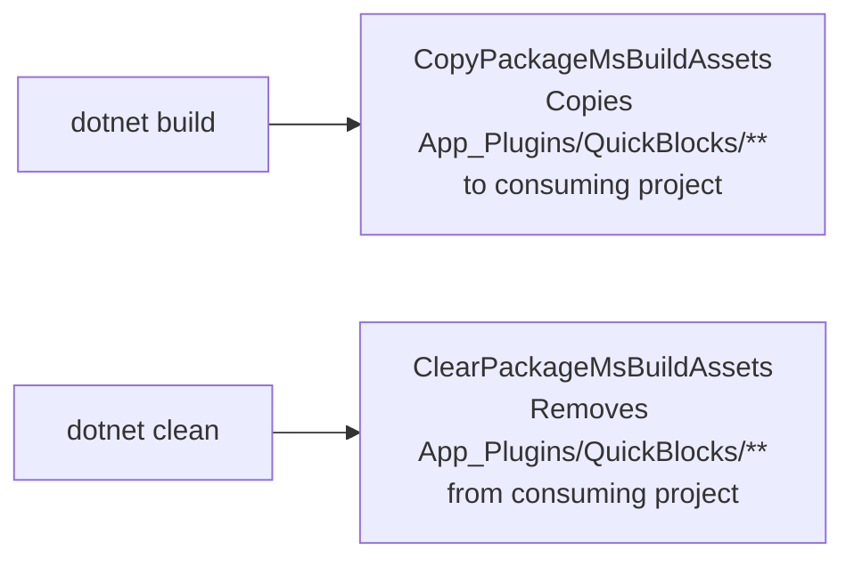

# QuickBlocks — Comprehensive Package Documentation

> **Package**: `Umbraco.Community.QuickBlocks`
> **Version**: 1.0.0
> **Target Framework**: .NET 6.0
> **Author**: Paul Seal (Umbraco MVP)
> **License**: MIT
> **Umbraco Compatibility**: v10.4.0+

---

## Table of Contents

1. [What Is QuickBlocks?](#1-what-is-quickblocks)
2. [How It Works — High Level](#2-how-it-works--high-level)
3. [Architecture Overview](#3-architecture-overview)
4. [Data Attributes Reference](#4-data-attributes-reference)
5. [Processing Pipeline (End-to-End)](#5-processing-pipeline-end-to-end)
6. [Service Layer](#6-service-layer)
   - [BlockParsingService](#61-blockparsingservice)
   - [BlockCreationService](#62-blockcreationservice)
   - [DataTypeNameResolver](#63-datatypename-resolver)
7. [Data Type Mapping System](#7-data-type-mapping-system)
8. [Domain Models](#8-domain-models)
9. [API Controller](#9-api-controller)
10. [Dashboard UI](#10-dashboard-ui)
11. [Dependency Injection & Composition](#11-dependency-injection--composition)
12. [Folder Structure Created in Umbraco](#12-folder-structure-created-in-umbraco)
13. [Generated Output](#13-generated-output)
14. [Extension Points](#14-extension-points)
15. [Configuration](#15-configuration)
16. [Build Pipeline](#16-build-pipeline)
17. [File Reference Map](#17-file-reference-map)

---

## 1. What Is QuickBlocks?

QuickBlocks is an **Umbraco back-office package** that scaffolds an entire block-list-based content architecture from a single annotated HTML file. Instead of manually creating dozens of content types, data types, block list configurations, and Razor partial views, a developer annotates their HTML prototype with `data-*` attributes and submits it to QuickBlocks. Within seconds, the package:

- Creates **element content types** for each block/row
- Creates **settings content types** for block-level visibility control
- Creates **block list data types** with full configuration
- Creates **partial view `.cshtml` files** with Razor rendering logic
- Creates **page content types** with the correct block list properties
- Creates **master and content templates**
- Organises everything into a **logical folder structure** in the Umbraco back-office

The result is a fully wired-up Umbraco block list setup ready for editors to use, with no manual configuration required.

---

## 2. How It Works — High Level



---

## 3. Architecture Overview



---

## 4. Data Attributes Reference

QuickBlocks reads a standard HTML document with special `data-*` attributes. Below is the complete specification.

### 4.1 Page / Content Type

| Attribute | Purpose | Example |
|-----------|---------|---------|
| `data-content-type-name` | Defines the page content type name | `"Home Page"` |

### 4.2 Block List

| Attribute | Purpose | Default |
|-----------|---------|---------|
| `data-list-name` | Names the top-level block list | required |
| `data-sub-list-name` | Names a nested block list inside a row | required (nested) |
| `data-list-maxwidth` | Max width of the property editor | `""` |
| `data-list-single` | Single block mode | `false` |
| `data-list-live` | Live editing mode | `false` |
| `data-list-inline` | Inline editing as default | `false` |
| `data-list-min` | Minimum number of blocks | `0` |
| `data-list-max` | Maximum number of blocks | `0` (unlimited) |
| `data-use-community-preview` | Enable community block preview | `false` |
| `data-preview-css` | Path to preview CSS file | `""` |
| `data-preview-view` | Path to preview HTML/view | `""` |

### 4.3 Row / Block Type

| Attribute | Purpose | Default |
|-----------|---------|---------|
| `data-row-name` | Names a top-level block type | required |
| `data-item-name` | Names a nested block type inside a sub-list | required (nested) |
| `data-settings-name` | Name of the settings content type | auto-generated |
| `data-has-settings` | Whether to create a settings type | `true` |
| `data-icon-class` | Icon CSS class for the block in the editor | `"icon-science"` |
| `data-icon-colour` | Icon colour class | `""` |
| `data-label-property` | Property alias used as editor label | `"Title"` |
| `data-ignore-convention` | Skip appending "Row" suffix to alias | `false` |

### 4.4 Property

| Attribute | Purpose | Notes |
|-----------|---------|-------|
| `data-prop-name` | Names the property | required |
| `data-prop-type` | Overrides the resolved data type name | optional; auto-resolved if omitted |
| `data-multiple` | Marks a link as multi-URL picker | for `<a>` elements |
| `data-replace-marker` | Marker string used in multiple URL iteration | e.g., `[!icon!]` |
| `data-replace-inner` | Replace inner HTML of each link | boolean |
| `data-replace-attribute` | Attribute on the link element to replace | e.g., `class` |

### 4.5 Partial View

| Attribute | Purpose |
|-----------|---------|
| `data-partial-name` | Marks an element as a standalone partial view to extract |

---

### 4.6 Full Annotated HTML Example

```html
<!-- Page content type definition -->
<div data-content-type-name="Home Page">

  <!-- Top-level block list -->
  <div data-list-name="Main Content"
       data-list-maxwidth="100%"
       data-list-min="0"
       data-list-max="0"
       data-list-live="false">

    <!-- Block type: Hero -->
    <section data-row-name="Hero"
             data-settings-name="Hero Settings"
             data-has-settings="true"
             data-icon-class="icon-landscape"
             data-label-property="Title">

      <h1 data-prop-name="Title">Hero Heading</h1>
      <p  data-prop-name="Body Text">Some description here</p>
      
      <a  data-prop-name="Call To Action" href="#">Learn More</a>
    </section>

    <!-- Block type: Services (with nested list) -->
    <section data-row-name="Services"
             data-icon-class="icon-settings"
             data-label-property="Title">

      <h2 data-prop-name="Title">Our Services</h2>

      <!-- Nested sub-list -->
      <div data-sub-list-name="Service Items"
           data-prop-name="Services"
           data-list-inline="true">

        <div data-item-name="Service Item">
          <h4 data-prop-name="Title">Service Name</h4>
          <p  data-prop-name="Description">Details</p>
          
        </div>
      </div>
    </section>
  </div>

  <!-- Standalone partial (e.g. footer) -->
  <footer data-partial-name="Footer">
    <p>© 2024 My Site</p>
  </footer>

</div>
```

---

## 5. Processing Pipeline (End-to-End)

```mermaid
flowchart TD
    A[POST /umbraco/backoffice/api/quickblocksapi/build/] --> B[QuickBlocksApiController.Build]
    B --> C{Input valid?}
    C -- No --> ERR[400 Bad Request]
    C -- Yes --> D[Load HTML via HtmlAgilityPack]
    D --> E{ReadOnly mode?}

    E -- Yes --> PARSE
    E -- No --> F[CreateFolderStructure]
    F --> G[CreateSupportingDataTypes\nSingle Url Picker]
    G --> H[CreateSupportingContentTypes\nBlock Visibility Settings]
    H --> PARSE

    PARSE[BlockParsingService] --> I[GetContentType\ndata-content-type-name]
    I --> J[GetLists — top-level\ndata-list-name]
    J --> K[foreach list: GetRows\ndata-row-name]
    K --> L[foreach row: GetProperties\ndata-prop-name]
    L --> M{Has nested sub-list?\ndata-sub-list-name}
    M -- Yes --> N[GetLists — nested\ndata-sub-list-name]
    N --> O[foreach sub-list: GetRows\ndata-item-name]
    O --> P[GetProperties for sub-rows]
    M -- No --> Q

    P --> Q{ReadOnly?}
    Q -- Yes --> REPORT[Build ContentTypeModel\nreturn as JSON report]
    Q -- No --> CREATE

    CREATE[BlockCreationService] --> R[CreateList for each top-level list]
    R --> R1[CreateRowPartial — cshtml per row]
    R --> R2[CreateBlockConfigurations]
    R2 --> R3[CreateBlockConfiguration per row\ncreates element + settings types]
    R3 --> R4[CreateBlockListDataType\nUmbraco BlockList editor]

    R4 --> S[GetPartialViews — data-partial-name]
    S --> T[CreatePartialViews]
    T --> U[ReplaceAllPartialAttributesWithCalls]
    U --> V[RemoveAllQuickBlocksAttributes]
    V --> W[RenderProperties — convert to Razor]
    W --> X[RenderListPropertyCalls]
    X --> Y[CreateContentType — page type]
    Y --> Z[AddPropertiesToContentType]
    Z --> AA[Create Master Template]
    AA --> AB[Create Content Template]
    AB --> REPORT
```



---

## 6. Service Layer

### 6.1 BlockParsingService

**File**: `src/QuickBlocks/Services/BlockParsingService.cs`

Responsible for reading the HTML document and extracting all structural information into domain models. It never writes to Umbraco — it only reads.

#### `GetContentType(HtmlNode node)`

Searches for a single node with `data-content-type-name`. Returns a `ContentTypeModel` with the name, alias, and any direct `data-prop-name` children.

#### `GetLists(string html, bool isNestedList, string prefix)`

XPath query: `//*[@data-list-name]` (top-level) or `//*[@data-sub-list-name]` (nested)

For each matching node:
- Reads all `data-list-*` attributes into `BlockListModel`
- Calls `GetRows()` to populate `.Rows`

#### `GetRows(string html, bool isNestedList)`

XPath query: `//*[@data-row-name]` or `//*[@data-item-name]`

For each matching node:
- Creates a `RowModel` from `data-row-name` / `data-item-name`
- Reads all row configuration attributes
- Calls `GetProperties()` for the row's direct properties
- Calls `GetLists(isNestedList: true)` to find any sub-lists within the row

#### `GetProperties(string html)`

XPath query: `//*[@data-prop-name]`

For each matching node:
- Reads `data-prop-name` as the property name
- If `data-prop-type` is present, uses that; otherwise calls `IDataTypeNameResolver.GetDataTypeName(tagName)` to resolve from the HTML element type
- Returns a `PropertyModel`

#### `GetBlocks(string html, string rowName)`

Finds block items (`data-item-name`) within a given row context.

#### `GetPartialViews(HtmlNode node)`

XPath query: `//*[@data-partial-name]`

Returns a list of `PartialViewModel` — each containing the partial name and its outer HTML.

---

### 6.2 BlockCreationService

**File**: `src/QuickBlocks/Services/BlockCreationService.cs`

The heart of the package. Translates parsed models into real Umbraco entities.

#### Folder Structure Creation



All IDs are stored in a `FolderStructure` object and passed through the pipeline so content types are organised automatically.

#### `CreateList(BlockListModel list, FolderStructure fs, int parentDataTypeId)`

1. Checks if a data type with this name already exists — skips if so
2. For each row in the list, calls `CreateRowPartial()`
3. Calls `CreateBlockConfigurations()` to build the block configuration array
4. Calls `CreateBlockListDataType()` to persist the data type

#### `CreateBlockConfiguration(RowModel row, FolderStructure fs, BlockListModel list)`



#### `CreateRowPartial(RowModel row)`

Creates a Razor partial view at:
```
Views/Partials/blocklist/Components/{alias}.cshtml
```

The generated view:
1. Casts `Model` to the correct element type
2. Wraps output in a null-check
3. Calls `RenderProperties()` to convert `data-prop-name` elements to Razor expressions
4. Calls `RenderListPropertyCalls()` to convert nested block lists to `@Html.GetBlockListHtml()`
5. Removes all remaining `data-*` attributes

#### `RenderProperties(HtmlNodeCollection properties, string context)`

Converts HTML property nodes to Razor output:

| Element | Generated Razor |
|---------|----------------|
| `h1`–`h6`, `span` | `@Model.Value("alias")` as inner text |
| `p` | `@Html.Raw(Model.Value("alias"))` (rich text) |
| `img` | `src="@Url.GetCropUrl(Model.Value<IPublishedContent>("alias"), 800, 600)"` |
| `a` (single) | `href="@Model.Value<Link>("alias")?.Url"` and `target` attribute |
| `a` (multi, `data-multiple`) | `foreach` loop over `IEnumerable<Link>` with marker replacement |
| other | Attribute and inner text replacement with custom markers |

#### `CreateBlockListDataType(BlockListModel list, List<BlockConfiguration> blocks, int parentDataTypeId)`

Creates an Umbraco data type using the `Umbraco.BlockList` property editor. The configuration object (`BlockListConfiguration`) is populated with:
- The array of `BlockConfiguration` items (content + settings key pairs)
- `UseSingleBlockMode`, `UseLiveEditing`, `UseInlineEditingAsDefault`
- `ValidationLimit.Min` / `ValidationLimit.Max`

---

### 6.3 DataTypeNameResolver

**File**: `src/QuickBlocks/Services/Resolvers/DataTypeNameResolver.cs`

Iterates `DataTypeMappersCollection` (last registered wins) to find the mapper whose `HtmlElements` list includes the queried element name. Falls back to `QuickBlocksDefaultOptions.DefaultDataTypeName` (`"Textstring"`) if no mapper matches.



---

## 7. Data Type Mapping System

QuickBlocks ships with four built-in mappers:

| Mapper Class | HTML Elements | Umbraco Data Type |
|---|---|---|
| `ImgDataTypeMapper` | `img` | `Image Media Picker` |
| `HeadersDataTypeMapper` | `h1`–`h6` | `Textstring` |
| `ParagraphDataTypeMapper` | `p` | `Richtext editor` |
| `AnchorDataTypeMapper` | `a` | `Single Url Picker` |
| *(default fallback)* | all others | `Textstring` |

### Registering a Custom Mapper

Implement `IDataTypeMapper` and register it in your own `IComposer`:

```csharp
public class MyDataTypeMapper : IDataTypeMapper
{
    public IEnumerable<string> HtmlElements => new[] { "textarea" };
    public string DataTypeName => "Textarea";
}

public class MyComposer : IComposer
{
    public void Compose(IUmbracoBuilder builder)
    {
        builder.QuickBlockDataTypeMappers().Append<MyDataTypeMapper>();
    }
}
```

Mappers use "last registered wins" ordering, so your custom mapper will override a built-in one if it targets the same element.

---

## 8. Domain Models



---

## 9. API Controller

**File**: `src/QuickBlocks/Controllers/QuickBlocksUmbracoApiController.cs`
**Route**: `/umbraco/backoffice/api/quickblocksapi/build/`
**Auth**: Umbraco back-office authentication required (`UmbracoAuthorizedApiController`)

### `POST Build(QuickBlocksInstruction)`

```mermaid
sequenceDiagram
    participant UI as Dashboard JS
    participant API as QuickBlocksApiController
    participant Parse as BlockParsingService
    participant Create as BlockCreationService
    participant Umbraco as Umbraco Services

    UI->>API: POST Build { HtmlBody, ReadOnly }
    API->>API: Load HTML via HtmlAgilityPack

    alt Not ReadOnly
        API->>Create: CreateFolderStructure()
        Create->>Umbraco: IContentTypeService.Save() x7 folders
        API->>Create: CreateSupportingDataTypes()
        Create->>Umbraco: IDataTypeService.Save() Single Url Picker
        API->>Create: CreateSupportingContentTypes()
        Create->>Umbraco: IContentTypeService.Save() Block Visibility Settings
    end

    API->>Parse: GetContentType(htmlNode)
    API->>Parse: GetLists(html, isNested=false)
    Parse-->>API: List~BlockListModel~

    loop Each BlockList
        API->>Parse: GetRows(html, isNested=false)
        Parse-->>API: List~RowModel~
        loop Each Row
            API->>Parse: GetProperties(html)
            API->>Parse: GetLists(html, isNested=true)
        end

        alt Not ReadOnly
            API->>Create: CreateList(list, folderStructure, parentId)
            Create->>Create: CreateRowPartial() per row
            Create->>Create: CreateBlockConfigurations()
            Create->>Umbraco: IContentTypeService.Save() element types
            Create->>Umbraco: IDataTypeService.Save() block list data type
        end
    end

    alt Not ReadOnly
        API->>Parse: GetPartialViews(htmlNode)
        API->>Create: CreatePartialViews()
        API->>Create: ReplaceAllPartialAttributesWithCalls()
        API->>Create: RemoveAllQuickBlocksAttributes()
        API->>Create: RenderProperties()
        API->>Create: RenderListPropertyCalls()
        API->>Create: CreateContentType() page type
        API->>Umbraco: IFileService.SaveTemplate() master + content
        Create->>Umbraco: IFileService.SavePartialView() per row
    end

    API-->>UI: ContentTypeModel JSON
```

### Response Shape

```json
{
  "name": "Home Page",
  "alias": "homePage",
  "conventionName": "HomePagePage",
  "properties": [...],
  "lists": [
    {
      "name": "Main Content",
      "rows": [
        {
          "name": "Hero Row",
          "alias": "heroRow",
          "properties": [
            { "name": "Title", "propertyType": "Textstring" },
            { "name": "Body Text", "propertyType": "Richtext editor" },
            { "name": "Background Image", "propertyType": "Image Media Picker" }
          ],
          "subLists": []
        }
      ]
    }
  ],
  "message": "Content type created successfully"
}
```

---

## 10. Dashboard UI

**Location**: `src/QuickBlocks/App_Plugins/QuickBlocks/`

The dashboard is an AngularJS (Umbraco back-office) view registered in the **Settings** section with weight `-10` (appears early in the list). Access is granted to `admin` and denied to `translator`.



### Key Controller Functions (`quickBlocks.js`)

```javascript
// Submit — creates all Umbraco entities
$scope.submit = function() {
    $scope.state = 'busy';
    quickBlocksResource.build({
        HtmlBody: $scope.model.htmlSnippet,  // or
        Url: $scope.model.url,
        ReadOnly: false
    }).then(function(response) {
        $scope.state = 'success';
        $scope.report = response.data;
        // switches to Report tab
    });
};

// Report — read-only analysis
$scope.report = function() {
    quickBlocksResource.build({
        HtmlBody: $scope.model.htmlSnippet,
        ReadOnly: true
    }).then(function(response) {
        $scope.report = response.data;
    });
};
```

---

## 11. Dependency Injection & Composition



The three composers (`QuickBlocksComposer`, `RegisterServicesComposer`, `NotificationHandlersComposer`) are all discovered automatically by Umbraco's composition system via the `IComposer` interface — no explicit registration in `Startup.cs` is needed.

### ServerVariables

`ServerVariablesParsingNotificationHandler` adds the build endpoint URL to Umbraco's server variables, making it available in JavaScript as:

```javascript
Umbraco.Sys.ServerVariables.QuickBlocks.QuickBlocksApi
```

---

## 12. Folder Structure Created in Umbraco

When QuickBlocks runs (non-read-only), it creates the following content type folder hierarchy:

```
Content Types (root)
├── Components/
├── Compositions/
│   └── Content Blocks/
│       ├── Content Models/
│       └── Settings Models/
├── Elements/
│   └── Content Blocks/
│       ├── Content Models/    ← element types for block content go here
│       └── Settings Models/   ← element types for block settings go here
├── Folders/
└── Pages/                     ← page content types go here
```

---

## 13. Generated Output

For a block named `"Hero"`, QuickBlocks generates:

### Element Content Type: `heroRow`
- Placed in `Elements/Content Blocks/Content Models/`
- Properties: `title` (Textstring), `bodyText` (Richtext editor), `backgroundImage` (Image Media Picker), `callToAction` (Single Url Picker)
- Is element type: `true`

### Settings Content Type: `heroSettings`
- Placed in `Elements/Content Blocks/Settings Models/`
- Properties: `hide` (checkbox) — inherited from Block Visibility Settings composition
- Is element type: `true`

### Block List Data Type: `"Main Content"`
- Editor: `Umbraco.BlockList`
- Contains block configuration referencing `heroRow` (content) and `heroSettings` (settings)
- Label template: `{{ !title || title == '' ? 'Hero Row' : title }}`

### Partial View: `Views/Partials/blocklist/Components/heroRow.cshtml`

```razor
@using ContentModels = Umbraco.Cms.Web.Common.PublishedModels;
@inherits Umbraco.Cms.Web.Common.Views.UmbracoViewPage<Umbraco.Cms.Core.Models.Blocks.BlockListItem>
@{
    var content = Model.Content as ContentModels.HeroRow;
    if (content == null) { return; }
}

<section>
    <h1>@content.Title</h1>
    <p>@Html.Raw(content.BodyText)</p>
    
    <a href="@content.CallToAction?.Url" target="@content.CallToAction?.Target">
        @content.CallToAction?.Name
    </a>
</section>
```

### Page Content Type: `homePage`
- Placed in `Pages/`
- Property: `mainContent` typed to the "Main Content" block list data type

### Templates
- `Master.cshtml` — base layout template
- `Home Page.cshtml` — content template inheriting master, renders block list

---

## 14. Extension Points

### Custom Data Type Mappers

Add support for additional HTML elements:

```csharp
// Map <video> elements to a "Video Picker" data type
public class VideoDataTypeMapper : IDataTypeMapper
{
    public IEnumerable<string> HtmlElements => new[] { "video" };
    public string DataTypeName => "Video Picker";
}

public class MyComposer : IComposer
{
    public void Compose(IUmbracoBuilder builder)
    {
        builder.QuickBlockDataTypeMappers().Append<VideoDataTypeMapper>();
    }
}
```

### Override Default Data Type

Change what unknown elements default to:

```csharp
// In Startup.cs or a composer
services.Configure<QuickBlocksDefaultOptions>(options =>
{
    options.DefaultDataTypeName = "Textarea";
});
```

### Replace a Built-in Mapper

Because the collection uses "last registered wins", you can override built-in mappers:

```csharp
// Override img to use a different picker
public class CustomImgMapper : IDataTypeMapper
{
    public IEnumerable<string> HtmlElements => new[] { "img" };
    public string DataTypeName => "Media Picker v3";
}
```

---

## 15. Configuration

### `QuickBlocksDefaultOptions`

```csharp
public class QuickBlocksDefaultOptions
{
    public string DefaultDataTypeName { get; set; } = "Textstring";
}
```

Override in `appsettings.json` or via `services.Configure<QuickBlocksDefaultOptions>()`.

### `package.manifest`

```json
{
  "name": "QuickBlocks",
  "version": "1.0.0",
  "allowPackageTelemetry": true,
  "dashboards": [{
    "alias": "quickBlocks",
    "view": "/App_Plugins/QuickBlocks/quickBlocks.html",
    "sections": ["settings"],
    "weight": -10,
    "access": [
      { "deny": "translator" },
      { "grant": "admin" }
    ]
  }]
}
```

---

## 16. Build Pipeline

`buildTransitive/Umbraco.Community.QuickBlocks.targets` contains MSBuild targets that ensure `App_Plugins` files are copied into consuming projects at build time:



The `buildTransitive` directory ensures these targets flow transitively through NuGet package references — the consuming project does not need to reference the targets file explicitly.

---

## 17. File Reference Map

```
src/QuickBlocks/
│
├── App_Plugins/QuickBlocks/
│   ├── package.manifest              # Dashboard registration, JS/CSS includes
│   ├── quickBlocks.html              # AngularJS dashboard template
│   ├── quickBlocks.js                # AngularJS controller + resource service
│   ├── quickBlocks.css               # Dashboard styles
│   └── lang/
│       └── en-us.xml                 # Localisation strings
│
├── buildTransitive/
│   └── Umbraco.Community.QuickBlocks.targets  # MSBuild copy targets
│
├── Composing/
│   ├── NotificationHandlersComposer.cs   # Registers notification handlers
│   └── RegisterServicesComposer.cs       # Registers IBlockCreation/Parsing services
│
├── Controllers/
│   └── QuickBlocksUmbracoApiController.cs  # Main API endpoint: POST Build
│
├── Models/
│   ├── BlockConfigModel.cs            # Block list configuration helper
│   ├── BlockItemModel.cs              # Nested block item (data-item-name)
│   ├── BlockListModel.cs              # Block list definition (data-list-name)
│   ├── ContentTypeModel.cs            # Page content type (data-content-type-name)
│   ├── FolderStructure.cs             # Holds IDs of created folders
│   ├── IDataTypeMapper.cs             # Interface for HTML→data type mapping
│   ├── PartialViewModel.cs            # Partial view definition (data-partial-name)
│   ├── PropertyModel.cs               # Property (data-prop-name)
│   ├── QuickBlocksInstruction.cs      # API request DTO
│   ├── RowModel.cs                    # Block/row definition (data-row-name)
│   └── DataTypeMappers/
│       └── DataTypeMappers.cs         # Built-in mapper implementations
│
├── NotificationHandlers/
│   └── ServerVariablesParsingNotificationHandler.cs  # Exposes API URL to JS
│
├── Services/
│   ├── IBlockCreationService.cs       # Interface for entity creation
│   ├── BlockCreationService.cs        # Creates content types, data types, partials
│   ├── IBlockParsingService.cs        # Interface for HTML parsing
│   ├── BlockParsingService.cs         # Parses data-* attributes into models
│   └── Resolvers/
│       ├── IDataTypeNameResolver.cs   # Interface for HTML→data type resolution
│       └── DataTypeNameResolver.cs    # Looks up mapper collection
│
├── DataTypeMappersCollection.cs       # Umbraco collection + builder + extensions
├── QuickBlocksComposer.cs             # Main composer: registers mappers + manifest
├── QuickBlocksDefaultOptions.cs       # Options class (default data type name)
├── QuickBlocksManifestFilter.cs       # Registers package manifest for telemetry
└── QuickBlocks.csproj                 # Package project file (.NET 6, NuGet config)
```

---

*Documentation generated for QuickBlocks v1.0.0 — Umbraco.Community.QuickBlocks*
